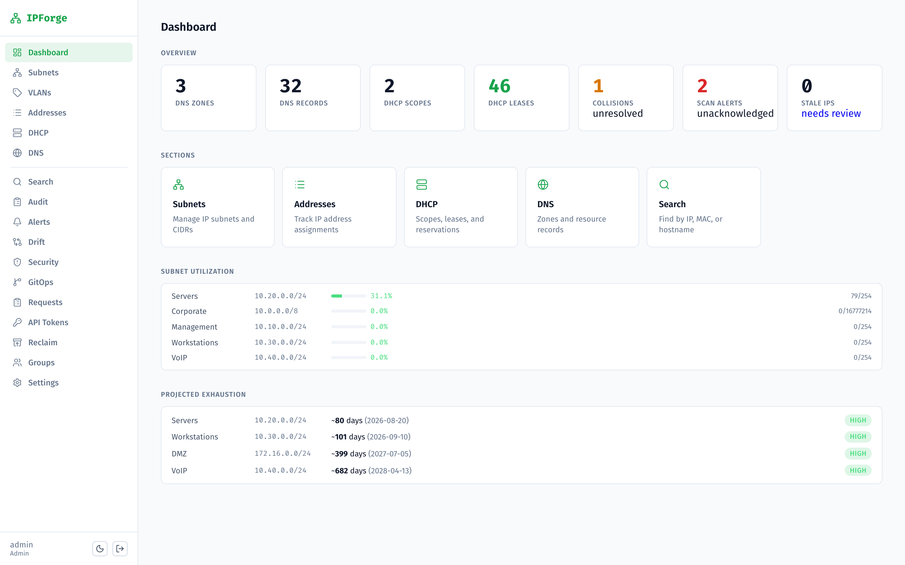
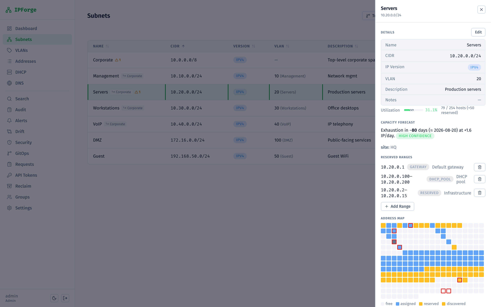
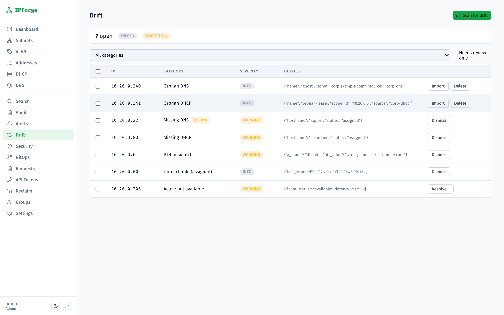
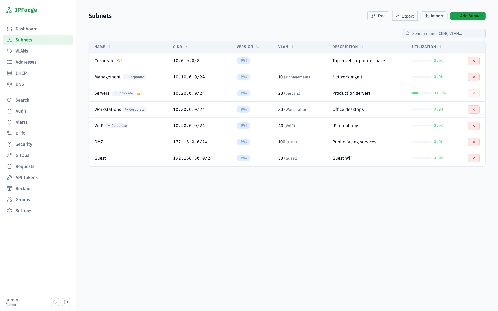
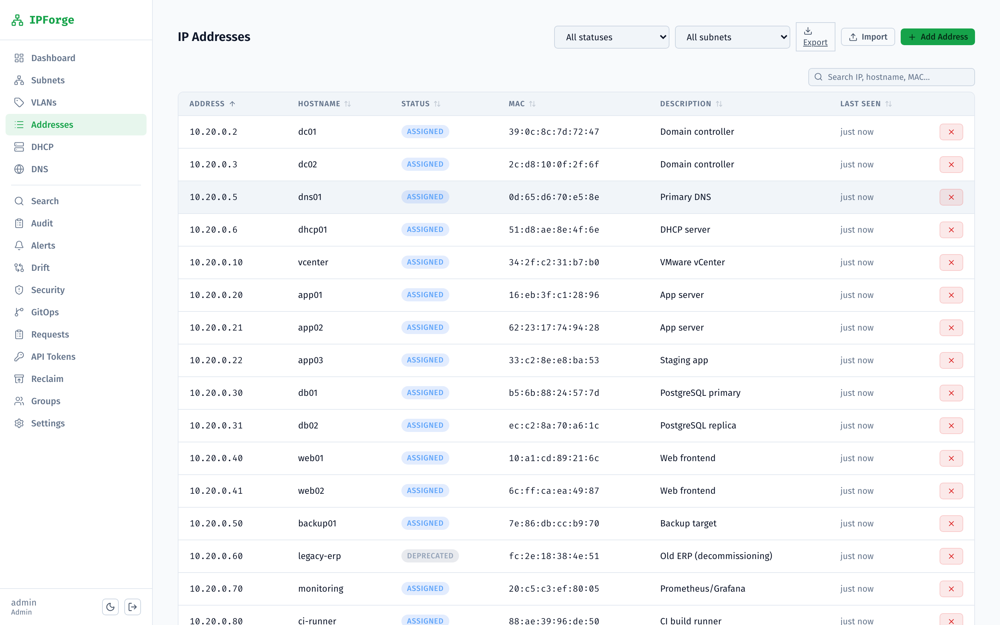
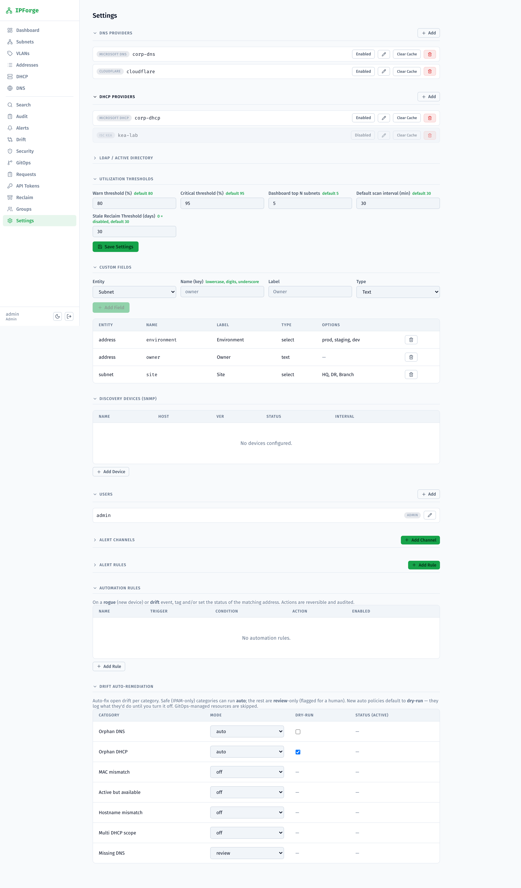
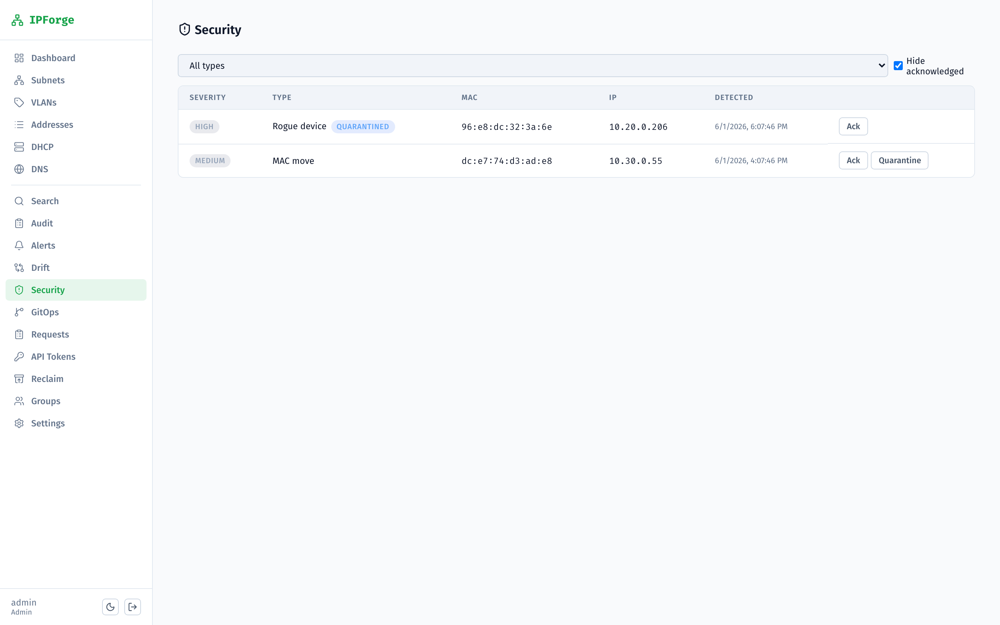
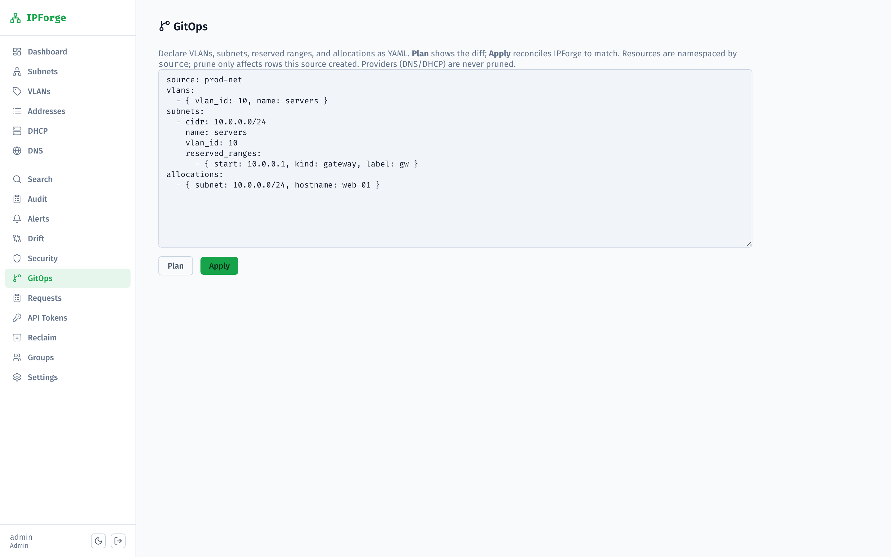

# IPForge

Self-hosted IP Address Management with integrated DNS and DHCP control.

Tracks subnets, IP allocations, DNS zones/records, and DHCP scopes/reservations across pluggable providers — Microsoft DNS/DHCP (WinRM), BIND (AXFR + RFC2136), Pi-hole v6, ISC Kea (v4 + v6), and cloud DNS (Cloudflare, Route 53, Azure DNS, Google Cloud DNS).

Unlike inventory-only IPAMs, IPForge **pushes** changes to your DNS and DHCP — and continuously reconciles drift between intended state and what's live.

**▶ [Watch the demo](docs/screenshots/ipforge-demo.mov)** — allocate an IP and see the DNS + DHCP records appear on the real servers.



## Screenshots

<table>
  <tr>
    <td width="50%"><br><sub><b>Subnet map</b> — per-address heatmap, reserved ranges, capacity forecast</sub></td>
    <td width="50%"><br><sub><b>Drift</b> — IPAM ↔ DNS ↔ DHCP ↔ live reconciliation</sub></td>
  </tr>
  <tr>
    <td width="50%"><br><sub><b>Subnets</b> — hierarchy, VLANs, utilization</sub></td>
    <td width="50%"><br><sub><b>Addresses</b> — status, tags, custom fields</sub></td>
  </tr>
  <tr>
    <td width="50%"><br><sub><b>Settings</b> — DNS/DHCP providers + drift auto-remediation policies</sub></td>
    <td width="50%"><br><sub><b>Security</b> — rogue device, MAC move, quarantine</sub></td>
  </tr>
  <tr>
    <td width="50%"><br><sub><b>GitOps</b> — declarative YAML apply with prune</sub></td>
    <td width="50%"></td>
  </tr>
</table>

## Features

- **IPAM core** — subnet hierarchy, reserved ranges, address-space heatmap, VLANs, custom fields + tags, and an idempotent allocation API (keyed by hostname, optional DNS/DHCP registration with rollback).
- **DDI providers** — pluggable DNS (`msdns`, `bind`, `pihole`, `cloudflare`, `route53`, `azure_dns`, `gcp_dns`) and DHCP (`msdhcp`, `keadhcp`, `pihole`), configured at runtime in **Settings → Providers** (not env vars), credentials Fernet-encrypted at rest.
- **Drift reconciliation** — continuous multi-way diff across IPAM ↔ DNS ↔ DHCP ↔ live scan, with per-category auto-remediation policies (dry-run by default, gitops-aware).
- **Continuous scanning** — per-subnet ping sweep + scheduler, reachability history, alert events.
- **Discovery & security** — SNMP ARP/FDB discovery (IP ↔ MAC ↔ switchport ↔ VLAN); rogue-device / MAC-move / IP-conflict detection with reversible quarantine.
- **GitOps** — declarative YAML for VLANs/subnets/ranges/allocations with managed-marker prune.
- **Capacity & lifecycle** — daily utilization snapshots + exhaustion forecasting; per-IP lifecycle timeline with point-in-time reconstruction.
- **Ops** — request/approval workflow, stale-IP reclamation, CSV import/export, audit log, alerting (email/webhook/Slack/Teams/PagerDuty), Prometheus `/metrics`, and an MCP server for agent-native access.
- **Auth/RBAC** — local + LDAP/AD, JWT + scoped API tokens, roles (admin / operator / scoped / requester / read-only) with per-subnet grants.

## Stack

- **Backend:** FastAPI, SQLAlchemy 2.0, PostgreSQL, Alembic
- **Frontend:** React + Vite + TypeScript, TanStack Query
- **Packaging:** Docker Compose for local dev/prod, Kustomize for Kubernetes

## Quick start (Docker Compose)

```bash
cp .env.example .env        # set DB_PASSWORD; JWT_SECRET_KEY/SECRET_KEY auto-generate if blank
docker compose up --build
```

> The Compose file references prebuilt images on GHCR
> (`ghcr.io/betz-anthony/ipforge/{api,web}`). Plain `docker compose up` pulls
> them — no local build required. Use `--build` only when developing against
> local source.

Web UI: <http://localhost> · API docs: <http://localhost:8000/docs>

Default login is `admin` / `admin` — change it immediately. DNS/DHCP providers are added afterward in the UI under **Settings → Providers** (no provider env vars).

## Local development

Backend:

```bash
cd backend
pip install -r requirements.txt
uvicorn app.main:app --reload   # http://localhost:8000
```

Frontend (Vite proxies `/api` to `localhost:8000`):

```bash
cd frontend
npm install
npm run dev   # http://localhost:5173
```

Tests:

```bash
cd backend && python -m pytest -q
cd frontend && npm run lint && npm run build
```

## Configuration

Server settings come from environment variables (see `.env.example`). Highlights:

| Variable | Purpose |
|---|---|
| `DATABASE_URL` | PostgreSQL connection string |
| `JWT_SECRET_KEY` | JWT signing key (auto-generated on first run if empty) |
| `SECRET_KEY` | Fernet key encrypting provider/LDAP secrets at rest (plaintext passthrough if empty) |
| `DEFAULT_ADMIN_PASSWORD` | Initial admin password (default `admin`) |
| `SYNC_MODE` | Background DNS/DHCP cache sync (`background` default) |
| `SCAN_INTERVAL_MINUTES` | Default per-subnet scan cadence |
| `UTIL_WARN_THRESHOLD` / `UTIL_CRITICAL_THRESHOLD` | Utilization alert thresholds (%) |
| `LDAP_*` | LDAP/AD bind, base DN, group→role mapping (see `.env.example`) |

**Providers are not configured via env vars.** DNS/DHCP backends and their credentials (WinRM host, Pi-hole URL, BIND TSIG key, Kea Control Agent URL, cloud API tokens, …) are added at runtime in **Settings → Providers** and persisted encrypted in the database.

## Architecture

```
backend/app/
  main.py              FastAPI app + lifespan (migrations, admin seed, and
                       background threads: scan scheduler, discovery poller,
                       sync, alert dispatcher)
  config.py            pydantic-settings — env-driven config
  database.py          SQLAlchemy engine, Base, get_db()
  models/              SQLAlchemy 2.0 ORM models (one file per domain)
  schemas/             Pydantic request/response schemas
  api/                 FastAPI routers, mounted with role dependencies
  core/                crypto, RBAC, audit, lifecycle, forecast, ptr, mac, ...
  providers/
    dns/   base + msdns, bind, pihole, cloudflare, route53, azuredns, gcpdns
    dhcp/  base + msdhcp, isc (Kea), pihole
    registry.py        builds providers from DB ProviderConfig rows
  drift.py / drift_remediation.py   reconciliation diff + auto-remediation
  scan.py / sync.py / discovery/    scanning, cache sync, SNMP discovery
  security.py / gitops.py / automation.py
  mcp_client.py / mcp_server.py     MCP server (separate process + deps)

frontend/src/
  api/client.ts        axios + typed API wrappers
  pages/               route-level pages
  components/          reusable UI primitives (SubnetSpace, DetailDrawer, ...)
  contexts/ hooks/ utils/
```

### Adding a provider

Implement the ABC in `backend/app/providers/dns/<name>.py` (or `dhcp/<name>.py`), add a branch to `registry._make_dns`/`_make_dhcp`, list any encrypted keys in `models/provider_config.SECRET_FIELDS`, and add the credential form to `Settings.tsx`. No API or model changes needed.

## Deployment

- **Docker Compose** — `docker compose up --build`. The backend builds from `backend/Dockerfile.prod`, the frontend (nginx) from `frontend/Dockerfile`.
- **Kubernetes** — manifests in `k8s/` are applied with `kubectl apply -k k8s/`. The Ingress expects an nginx-ingress controller and a TLS Secret (see `k8s/ingress.yaml`). Prebuilt images are published to GHCR.
- **Database migrations** — Alembic. Migrations run automatically on startup (`main.py` upgrades to head); CI/CD can run `alembic upgrade head` explicitly.

## Security

- Authentication: local users + optional LDAP/AD bind with group→role mapping
- Roles: `admin` / `operator` / `readonly` / `requester` / `scoped` (per-subnet RBAC)
- All provider credentials encrypted at rest with Fernet (`SECRET_KEY`)
- Audit log captures create/update/delete with before/after state and acting user
- API tokens for machine clients (Prometheus, scripts) with scoped permissions

## License

GNU Affero General Public License v3.0 — see [LICENSE](LICENSE).

AGPLv3 means modifications must be released with source available — including when
you run a modified IPForge as a **network service** (not only when you distribute
binaries). If AGPL doesn't fit your use, a separate **commercial license** is
available; open an issue or get in touch.
